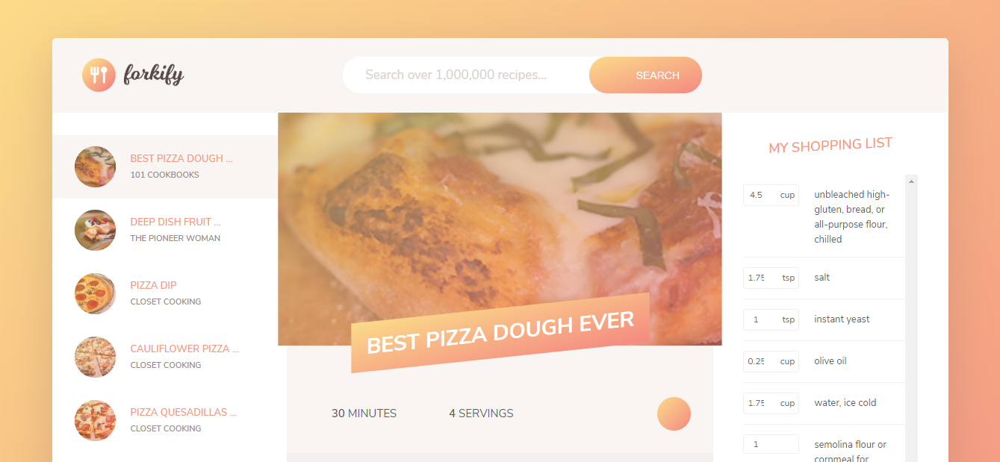

# Forkify

Project build with the design pattern Model, Views and Controllers (MVC) in vanilla JavaScript where I build an API of a recipe website following the guide in the Udemy course "The Complete JavaScript Course 2020: Build Real Projects!" created by Jonas Schmedtmann.

## Built With

- HTML
- CSS
- Sass
- Javascript
- Parcel
-

### Documentations

- https://forkify-api.herokuapp.com/v2

## Authors

- 👤GitHub: [Jose Abel Ramirez](https://github.com/jose-Abel)

## Getting Started

You can clone this code anytime and load the HTML file on your browser. Since it was build with vanilla JavaScript and the bundle was already built, it doesn't need any other package, the index.html file is located in the dist folder.

## Live version

https://reverent-panini-32629b.netlify.app/

### Setup

You can either copy the code with git clone or just do a git pull on your local environment.

### Acknowledgments

Appreciate the teams at Udemy and the creator of the course Jonas Schmedtmann since allows me to learn a lot of JavaScript concepts and design principles that is pushing my software development career higher.

## 📝 License

This project is MIT licensed.

## Show your support

Give a ⭐️ if you like this project!
